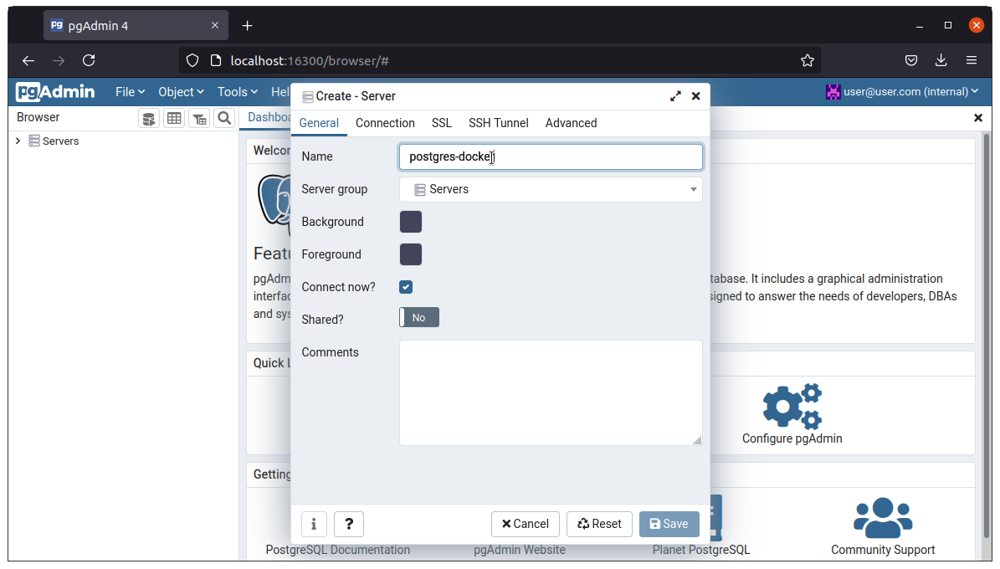

# Principais comandos

## Docker

**Instanciar container postgres**
```bash
docker-compose up -d
```

**Derrubar container postgres**
```bash
docker-compose down
```

**Iniciar o container postgres parado**
```bash
docker-compose start
```

**Parar o container postgres rodando**
```bash
docker-compose stop
```

**Verificar instância rodando**  
Navegar até a pasta onde está o arquivo docker-compose do projeto e:
```bash
docker-compose ps
```

## Postgres 
 
Para acessar o postgres pela linha de comando, com o container iniciado, abra o terminal e cole a linha abaixo, substituindo o **\<docker-container-name>** pelo nome do container postgres. Para identificar o nome do container, utilize o comando **Verificar instância rodando**.  
  
```bash
docker exec -it <docker-container-name> psql -h <docker-container-name> -U user
```

## Acesso pelo pgAdmin4
1. Acesse o link [http://localhost:16300](http://localhost:16300);
2. Entre com o usuário: ``` user@user.com ```;
3. Digite a senha: ``` pg@dmin```;
4. Clique em **Login**
  
5. Clique em "**Add New Server**";
  
6. "**Adicione**" o nome do servidor

7. "**Configure**" a conexão, preenchendo os campos conforme os dados usados no docker-compose;  
   **Host name/address:** \<docker-container-name> ``` Para identificar o nome do container, utilize o comando ``` **Verificar instância rodando**.  
   **Maintenance database:** user  
   **Username:** user  
   **Password:** password  

8. Clique em "**Save**"  
